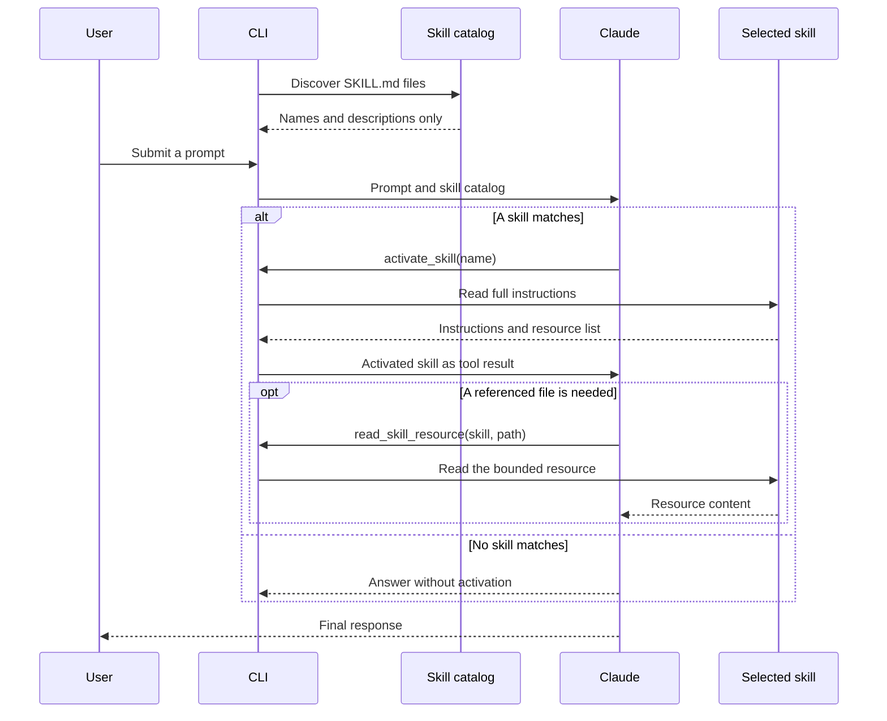
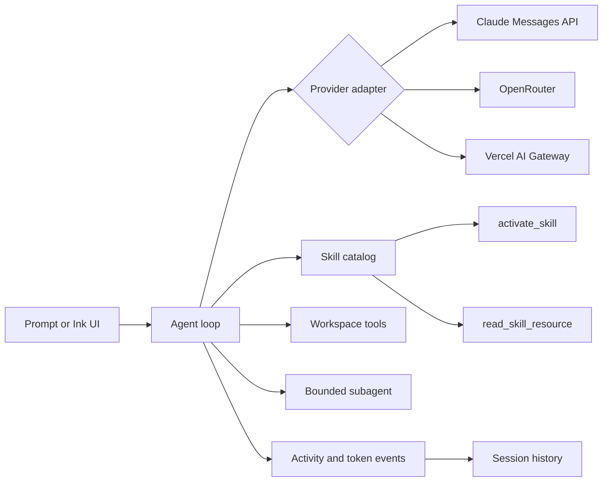

# mini-agent

A small Node.js coding agent that calls Claude directly and implements the core
[Agent Skills](https://agentskills.io/) lifecycle: discover, disclose, activate,
and follow.

The central constraint is progressive disclosure. Claude initially receives only
each skill's `name` and `description`. Full instructions enter the conversation
only after Claude selects the skill, and supporting files are read separately when
the active skill needs them.

## Quick start

Requirements: Node.js 20.11 or newer and an Anthropic API key.

```bash
npm install
export ANTHROPIC_API_KEY="your-key"
npm run dev -- "I'm new to this project, what should I do?"
```

The onboarding prompt activates `welcome-me` and follows the bundled skill. The
linked upstream skill currently requires this first line:

```text
> Welcome to our Command Code assignment agent!
```

An unrelated prompt must not load those instructions:

```bash
npm run dev -- "What's the weather?"
```

To prove the selection path without spending API credits, run the deterministic
demo:

```bash
npm run demo:mock
```

The mock is deliberately narrow. It proves discovery, activation, and tool-loop
plumbing; normal questions require a configured model provider.

## What to test

| Prompt | Expected skill |
| --- | --- |
| `I'm new to this project, what should I do?` | `welcome-me` |
| `Turn the recent commits into release notes.` | `changelog-generator` |
| `What's the weather?` | None |

Use `--debug` to print activations to stderr or `--json` for structured output:

```bash
npm run dev -- --debug "I'm new to this project"
npm run dev -- --json "Turn the recent commits into release notes"
```

## How skill loading works



This follows the specification's three context levels:

1. **Catalog:** load every skill's name and description.
2. **Instructions:** load one complete `SKILL.md` body after activation.
3. **Resources:** load referenced files only when they are needed.

The `activate_skill` schema contains an enum of discovered names, so the model
cannot request an unknown skill. `/welcome-me ...` and other skill slash commands
also support explicit user activation.

## Architecture



The provider boundary normalizes text, tool calls, stop reasons, request IDs, and
token usage. Anthropic is implemented with Node's native `fetch` against the Claude
Messages API; there is no Anthropic SDK dependency.

## Interactive terminal

Run without a prompt to open the React/Ink interface:

```bash
npm run dev
```

If a provider has no saved key, use `/key`. Choose a provider, confirm or edit its
model ID, and enter the key in the masked input. Keys are stored outside session
files with owner-only permissions. Environment variables take precedence over saved
credentials.

Useful controls:

| Control | Action |
| --- | --- |
| `/` | Search commands and installed skills |
| `Ctrl+P` | Search OpenRouter models |
| `Ctrl+R` or `/rewind` | Rewind conversation context |
| `Escape` | Stop the active run |
| `Ctrl+C` | Exit |

The conversation displays streamed response text, model turns, skill activation,
tool and subagent activity, stop reasons, and token usage. The viewport stays within
the current terminal height instead of pushing live activity below the composer.

Sessions are saved locally. `/history` lists them, `/resume` opens an earlier
session, and `/redo` reapplies a rewound turn. Rewind changes conversation context
only; it does not claim to reverse file changes.

## Providers and models

Anthropic is the default provider and `claude-sonnet-5` is the default model.

| Provider | Key | Example model |
| --- | --- | --- |
| Anthropic | `ANTHROPIC_API_KEY` | `claude-sonnet-5` |
| OpenRouter | `OPENROUTER_API_KEY` | `deepseek/deepseek-v4-flash` |
| Vercel AI Gateway | `AI_GATEWAY_API_KEY` | `anthropic/claude-sonnet-4.6` |

Select a provider or model from the command line:

```bash
npm run dev -- -p openrouter -m deepseek/deepseek-v4-flash "Review this project"
npm run dev -- -p vercel -m anthropic/claude-sonnet-4.6 "Write release notes"
```

Model IDs are passed through to the provider. OpenRouter's `Ctrl+P` picker fetches
tool-capable models, supports search, and accepts a complete custom model ID.

## Workspace tools

The agent can inspect and edit one workspace through explicit tools:

- list files;
- search with `rg` without invoking a shell;
- read bounded files;
- inspect bounded git history;
- write files;
- apply precise text edits.

Every requested path and resolved symlink target must stay inside the workspace.
Use `--workspace <path>` to select a different root or `--read-only` to remove write
and edit tools.

An offline tool-loop demo creates a small page in a temporary workspace:

```bash
npm run dev -- --mock --workspace /tmp/mini-agent-demo "Create an HTML page"
```

## Native workflow

The optional workflow separates planning, execution, and verification:

```text
/plan Add validation to the config loader
/start-work
/loop 6
```

`/plan` stores a decision-complete plan using read-only tools. `/start-work` gives
one step to `super-executor` and asks `super-verifier` to inspect the result.
`/loop` repeats that bounded cycle until every step passes or the iteration limit
is reached.

Set `VERIFY_CMD` when the project has a canonical local check:

```bash
VERIFY_CMD="npm test" npm run dev
```

Five focused role definitions live in `agents/`: `super-planner`, `super-executor`,
`super-verifier`, `super-explorer`, and `super-oracle`. The main agent can also
delegate a small number of tool-free analysis tasks. Set `--subagents 0` to disable
that capability.

## Project structure

```text
.skills/          three bundled assessment skills
agents/           native workflow role definitions
src/agent/        model and tool loop
src/providers/    Anthropic and compatible provider adapters
src/session/      session history, resume, rewind, and redo
src/skills/       discovery, validation, activation, and resources
src/tools/        bounded workspace tools
src/ui/           React/Ink terminal interface
src/workflow/     plan, execute, and verify workflow
tests/            behavior tests at public seams
scripts/          build, size, and release checks
```

Skill discovery checks the bundled `.skills` directory, `~/.agents/skills`,
`.agents/skills`, and a project `.skills` directory. Project skills take precedence.
Malformed or invalid skills appear in `skills doctor` instead of crashing startup.

```bash
npm run dev -- skills list
npm run dev -- skills doctor
```

## Verification and packaging

Run the complete local gate:

```bash
npm run check
```

It runs the type checker, sixty behavior tests, full and lite builds, and byte-budget
checks. Build the installable release archive with:

```bash
npm run pack:release
```

Current arm64 macOS measurements:

| Artifact | Size |
| --- | ---: |
| Lite headless CLI | 154,345 bytes |
| Full CLI, UI, skills, roles, and notices | 905,099 bytes |
| Compressed release archive | < 350 KB |

Both builds require an installed Node.js runtime. The size measurements do not hide
an embedded standalone runtime. The release contains bundled, minified application
code and no production dependency declarations.

To install the generated archive as a command available from any directory:

```bash
npm install -g ./artifacts/mini-agent-0.1.0.tgz
mini-agent
```

## Submission notes

**Time spent:** about six hours across specification review, implementation, tests,
terminal QA, and packaging.

**Challenges:** the most important design choice was proving that skill
instructions are absent before activation, not simply saying they are loaded lazily.
Resource files and workspace tools also needed a real path boundary that rejects
traversal and symlink escapes. The provider adapters were kept small and use native
`fetch`, while the agent loop remains provider-independent.

The deterministic suite covers selection and negative matching without
credentials. A live Sonnet smoke test is intentionally not part of the automated
gate because it would require a secret and spend API credits.

The bundled skills are pinned to their source commit with their license files. See
[THIRD_PARTY_NOTICES.md](THIRD_PARTY_NOTICES.md).
